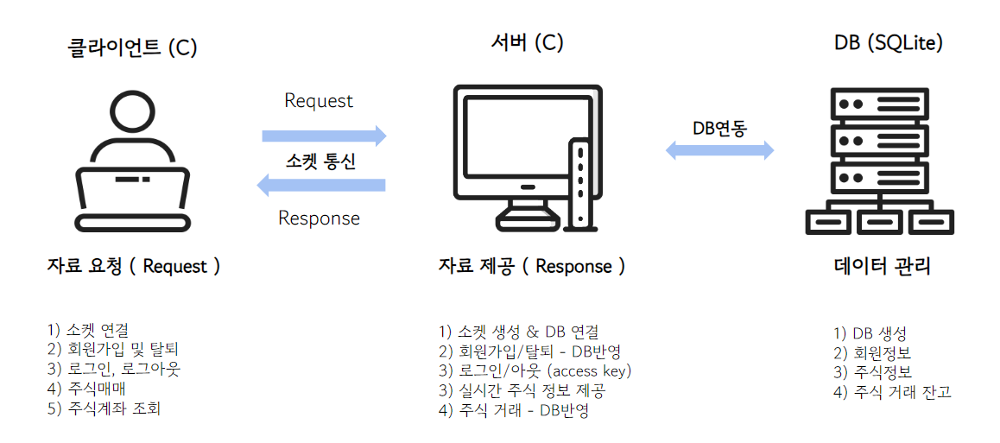
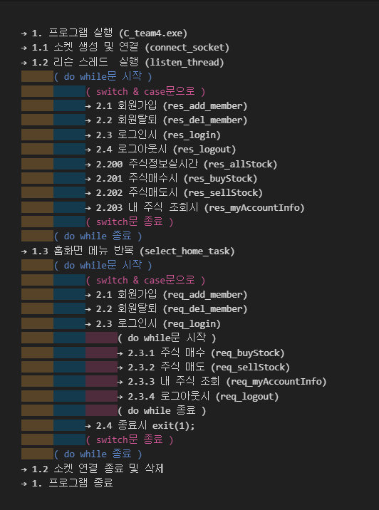
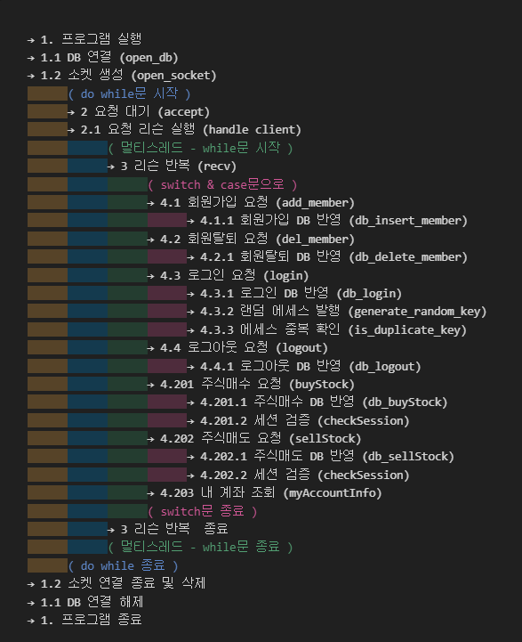
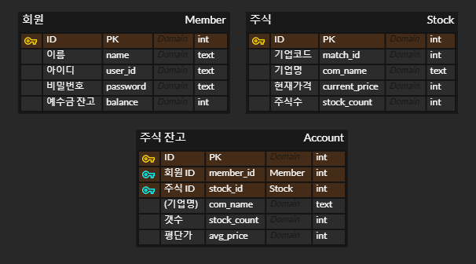

# 실시간 주식 시뮬레이션

<hr/>

### 프로젝트 소개


`소켓을 통해 서버와 클라이언트를 구현하고 DB와 연결보며 네트워킹 및 주식거래 구현에 대한 정보 습득 `

다우기술 ITS부문 비전공 신입 사원 프로젝트입니다.
<br/>
팀원 : 조준하, 전채은, 유재호
<br/>
프로젝트 기간 : 24.02.20 ~ 24.02.28
<br/>


<br/>


<hr/>

### 프로젝트 설치
1. 클론
```
git clone https://github.com/DAOU-C-team4/stock-simulation.git
```
2. 폴더 이동
```
cd stock-simulation/
```
##### 2.1 단순실행시 (로컬 테스트)
1. 실행폴더 이동
```
cd EXE/
```
2. 서버 실행
```
(파일 클릭 혹은)
cd server/
./C_team4.exe
```
3. 클라이언트 실행
```
(파일 클릭 혹은)
cd client/
./C_team4_client.exe
```
##### 2.2 코드로 빌드시 (IP주소 확인)
```
VS 툴 사용 권장
```

+추가
1. [ DB browser tool](https://download.sqlitebrowser.org/DB.Browser.for.SQLite-3.12.2-win64.msi) : DB GUI로 조회

<br/>
<hr/>

### 프로젝트 아키텍처

1. 서버 : C기반으로 작성한 콘솔로 소켓통신(클라이언트) + DB연동
2. DB : sqlite3로 서버와 연동
3. 클라이언트 : C기반으로 작성한 콘솔로 입출력 기반으로 서버와 통신

<br/>
<hr/>

### 프로젝트 코드 구조

##### 클라이언트


##### 서버


<br/>
<hr/>

### 프로젝트 DB ERD


<br/>
<hr/>

